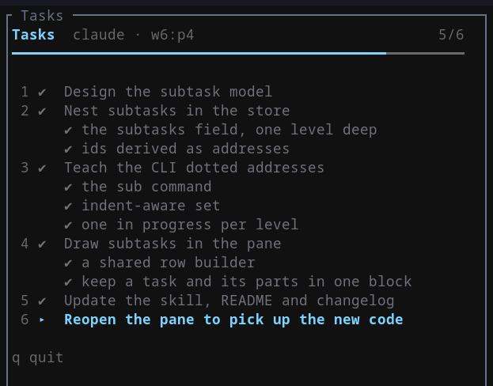

# herdr-tasks

A Herdr plugin that shows the task list of the agent you are watching, in a split pane beside it, with items checked off as the agent finishes them.

Agents already plan their work, and most will write the plan down if you ask. The problem is that the list scrolls away inside the conversation, so following along means reading every line of output to work out where the agent is. This puts the list somewhere it stays put.

Press one key, the list appears next to the agent. Press it again, the list goes away.



A step that breaks into pieces can carry subtasks, one level deep, like tasks 2, 3 and 4 above. The count in the header stays on tasks, so a step with six subtasks is still one step of six. A step that cannot go forward gets marked blocked instead, and the agent's reason for it appears under the task.

## How it gets the tasks

The agent publishes its own list. Claude Code, Codex, Gemini, something you wrote yourself: anything that can run a shell command drives the pane with `herdr-tasks set`, `herdr-tasks done 2`, and a few others. Setup installs a skill that teaches them how, so usually there is nothing to explain.

The CLI writes a small JSON file per pane. The pane watches that file, so an update shows up the moment it lands.

An earlier version of this plugin mirrored Claude Code's own todo list through a `PostToolUse` hook on `TodoWrite`, which needed nothing at all from the agent. That is gone. `TodoWrite` is disabled by default in current Claude Code, replaced by `TaskCreate`, `TaskGet`, `TaskList` and `TaskUpdate`, and a session with none of those enabled emits nothing to hook. The CLI works the same way in every agent, so it is the only path now.

## Requirements

- Herdr 0.9.0 or newer
- Node 18 or newer, which you already have if you run Claude Code
- An agent that can run a shell command, which is all of them

No dependencies to install. The whole plugin is plain Node scripts.

## Install

```bash
herdr plugin install pinkpixel-dev/herdr-plugins/herdr-tasks
```

Or from a local checkout while you work on it:

```bash
herdr plugin link /path/to/herdr-tasks
```

## Setup

Installing registers the plugin. Two more things are needed, and both write outside the plugin, so neither happens on its own.

**1. Run the setup action.** It installs the agent skill, writes the CLI shim, and seeds the config file.

```bash
herdr plugin action invoke pinkpixel.herdr-tasks.configure
```

It prints every path it wrote and the keybinding block from the next step. Two things land outside the plugin:

| What | Where |
|---|---|
| the `herdr-tasks` skill | `~/.claude/skills/` and `~/.agents/skills/`, whichever exist |
| the `herdr-tasks` command | the plugin config directory |

The skill is written with the real path of the command filled in, and marked with a `.installed-by-herdr-tasks` file. An unmarked `herdr-tasks` skill directory is left alone, so a skill you wrote yourself is safe. The one exception is a `SKILL.md` that is byte-identical to the plugin's own template, which means a sync tool or a manual copy put it there with the path placeholder still in it. That copy gets finished and marked, because an agent reading it would otherwise find a placeholder instead of a command.

**2. Bind the pane to a key.** Add this to `~/.config/herdr/config.toml`:

```toml
[[keys.command]]
key = "prefix+t"
type = "plugin_action"
command = "pinkpixel.herdr-tasks.toggle"
description = "toggle the task list pane"
```

Then reload:

```bash
herdr server reload-config
```

Use any key you like. `prefix+t` is a suggestion, picked so it sits next to the file viewer's `prefix+f` and avoids a bare `ctrl` chord your terminal may already claim.

## Using it

Press the key in the pane running your agent. The task list opens to the right and the agent keeps focus, so you can carry on typing. Press the key again and the pane closes. The list itself survives, so reopening shows the current state.

It is an ordinary Herdr pane, so resizing, moving, zooming, and swapping all work with your normal Herdr keys.

The pane scrolls itself. A list longer than the pane follows the in-progress task, so the current step stays on screen without you touching anything. The keys below matter only for a list that does not fit, and the footer hides them when it does:

| Key | Does |
|---|---|
| `q` | close the pane |
| `j` / `k` | scroll down / up |
| `g` / `G` | jump to the top / bottom |
| `f` | go back to following the in-progress task |

Turn the automatic scrolling off with `follow_active = false` if you would rather the list stayed where you left it.

One list per agent pane. The pane is tied to whichever pane was focused when you pressed the key, so two agents in the same tab each get their own list and their own pane.

## Asking for a list

Most of the time the agent decides. The skill tells it to publish a list once the work has three or more steps, so a substantial task usually fills the pane on its own.

When you want one and did not get one, ask for it directly. In Claude Code the skill is a slash command, so you can put it in front of your actual request:

```
/herdr-tasks refactor the auth module and update the tests
```

Other agents take it in plain words: tell them to use the herdr-tasks skill, and they will read it and publish as they go.

## Driving it from an agent

The setup action writes a `herdr-tasks` command into the plugin's config directory. Find it with:

```bash
herdr plugin config-dir pinkpixel.herdr-tasks
```

The commands:

```bash
herdr-tasks set "read the spec" "write the parser" "add tests"
herdr-tasks start 2                      # mark in progress
herdr-tasks done 2                       # mark complete
herdr-tasks done parser                  # ... or name it instead of counting
herdr-tasks next                         # complete the active task, start the next one
herdr-tasks block 3 "waiting on the API key"
herdr-tasks add "fix the thing I broke"
herdr-tasks sub 2 "the tokenizer" "the grammar rules"
herdr-tasks start 2.2                    # a subtask, by parent.child
herdr-tasks show
herdr-tasks clear
```

Every command prints the list back, which is also how the agent reads its own state. Tasks are numbered by position, a subtask is `parent.child`, and a text argument matches the first task or subtask containing it.

Subtasks can also go in with the plan. An indented line in `set` hangs off the line above it, so a markdown list pasted on stdin keeps its shape:

```bash
herdr-tasks set - <<'EOF'
- read the spec
- write the parser
  - the tokenizer
  - the grammar rules
- add tests
EOF
```

Starting a subtask starts its parent too, and `next` works through a task's subtasks before it moves on. Completing a task completes whatever is left inside it.

Setup installs [the skill](skills/herdr-tasks/SKILL.md) that explains all of this to an agent, with the real command path filled in, so an agent that reads `~/.agents/skills` or `~/.claude/skills` can find it on its own. For an agent that reads neither, point at the same file from the project's `AGENTS.md`:

```md
## Task list

Publish your plan to the Herdr Tasks pane. Read ~/.agents/skills/herdr-tasks/SKILL.md for how.
```

Symlinking the shim onto your `PATH` shortens the commands, and is worth doing if you use the CLI path a lot.

## Configuration

The setup action seeds `config.toml` in the plugin config directory. Every key is optional. The full file with comments is [config.example.toml](config.example.toml), and the settings are:

| Key | Default | Does |
|---|---|---|
| `title` | `"Tasks"` | heading when the list has no name of its own |
| `focus_on_open` | `false` | whether the pane takes focus when it opens |
| `show_completed` | `true` | keep finished tasks on screen |
| `show_progress_bar` | `true` | draw the bar under the heading |
| `follow_active` | `true` | scroll a long list to keep the current task visible |
| `[icons]` | `○ ▸ ✔ ⊘` | one glyph per state |
| `[colors]` | sky / zinc / red | `accent`, `done`, `blocked`, as hex |

Pending tasks use your terminal's own foreground color, so the list picks up your theme instead of fighting it.

## Removing it

```bash
herdr plugin action invoke pinkpixel.herdr-tasks.unconfigure
herdr plugin uninstall pinkpixel.herdr-tasks
```

The first removes the skill it installed and deletes the shim. Your `config.toml` and any saved lists stay where they are, so reinstalling picks up where you left off. Delete the config and state directories by hand if you want them gone.

## How it works

```text
herdr-plugin.toml      the manifest: one pane, three actions, one startup hook
bin/
  pane.js              the pane: watches the state directory, draws the list
  toggle.js            the key: open a split, or close the one in this tab
  tasks.js             the CLI your agents call
  configure.js         setup and teardown, the only thing that writes outside
lib/
  store.js             one JSON file per pane, written atomically
  render.js            record plus size in, styled lines out
  config.js            config.toml, with a small TOML reader
  paths.js             where state, config and the Herdr binary live
skills/
  herdr-tasks/SKILL.md the instructions setup installs for your agents
```

The pane finds its agent through `HERDR_TASKS_TARGET`, which the toggle passes when it opens the split. Without it the pane falls back to whichever pane Herdr reports as focused.

The toggle finds an open task pane by its label, which Herdr sets from the pane title in the manifest. If you change that title, change `PANE_LABEL` in `bin/toggle.js` to match. A check in `tools/check.js` fails if they drift apart.

Pane ids are not stable forever, so a closed pane leaves its list behind. The toggle sweeps lists whose pane no longer exists each time it opens a pane, which avoids paying for an event hook to do the same job.

## Development

```bash
herdr plugin link /path/to/herdr-tasks
node tools/check.js
herdr plugin log list --plugin pinkpixel.herdr-tasks --limit 20
```

`plugin link` does not run build commands, but there is nothing to build here. The checks cover the store, the CLI, the renderer, the config reader, and what setup writes, all against a temporary state directory and a fake home.

## Known limitations

- Nothing is automatic. Whether a list appears depends on the agent reading the skill, or your `AGENTS.md`, and actually calling the CLI.
- The CLI needs `HERDR_PANE_ID` in the agent's environment, so the agent has to be running in a Herdr pane. An agent started outside Herdr needs `--pane`.
- Tested on Linux. The code avoids anything platform-specific and ships a Windows shim, but macOS and Windows have not been exercised yet.
- The pane is read-only. You cannot check something off yourself from inside it, although `herdr-tasks done 2` from any shell works.
- One task list per pane, not per agent session. A pane that closes loses its list.

## License

Apache 2.0. See [LICENSE](LICENSE).

Made with 💖 by Pink Pixel
